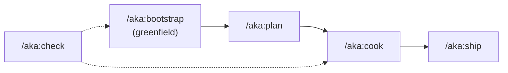
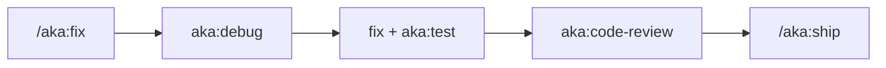

# Agentic Flows

Canonical slash-command pipelines bundled with aka-kit **shared** preset. These are **skill-level** commands (`/aka:*`), not CLI subcommands.

## Happy Path (feature development)

### Greenfield project

1. **`/aka:bootstrap`** — clarify requirements, pick stack, run `aka-kit install --<preset>`, write plan
2. **`/aka:check`** — verify Node, MCP, skills after install
3. **`/aka:cook plans/.../plan.md`** — execute approved plan (test + review included)
4. **`/aka:ship`** — merge target, test, review, commit, push, open PR

### Existing codebase (new feature)

1. **`/aka:plan`** `<feature>` — phased plan in `plans/` (no code)
2. User approves plan
3. **`/aka:cook`** `plans/.../plan.md` — implement phases
4. **`/aka:ship`** — land the branch

## Bugfix path

1. **`/aka:fix`** `<issue>` — activates `aka:debug` first, then fix → test → review
2. Optional **`/aka:ship`** if ready to merge

For unfamiliar codebases, flows may start with **`aka:scout`** before debug.

## Command reference

| Command          | Skill           | Purpose                                               |
| ---------------- | --------------- | ----------------------------------------------------- |
| `/aka:bootstrap` | `aka:bootstrap` | Interactive greenfield: stack → install preset → plan |
| `/aka:plan`      | `aka:plan`      | Write phased plan to `plans/` — **no implementation** |
| `/aka:cook`      | `aka:cook`      | End-to-end implement (scout/plan/code/test/review)    |
| `/aka:fix`       | `aka:fix`       | Debug → fix → test → review                           |
| `/aka:ship`      | `aka:ship`      | Test → review → commit → push → PR                    |
| `/aka:check`     | `aka:check`     | Run `aka-kit doctor` + interpret results               |

### Flags (common)

| Skill | Flags                                                            |
| ----- | ---------------------------------------------------------------- |
| plan  | `--fast`, `--hard`, `--parallel`                                 |
| cook  | `--interactive`, `--fast`, `--auto`, `--no-test`                 |
| fix   | `--auto`, `--review`, `--quick`                                  |
| ship  | `official`, `beta`, `--skip-tests`, `--skip-review`, `--dry-run` |
| check | `--quick`, `--json`                                              |

## Composed skills (building blocks)

Workflow commands orchestrate these **aka:** skills:

| Skill                    | Used by                        |
| ------------------------ | ------------------------------ |
| `aka:scout`              | plan, cook, fix                |
| `aka:research`           | plan, cook, bootstrap          |
| `aka:debug`              | fix (required first step)      |
| `aka:test`               | cook, fix, ship                |
| `aka:code-review`        | cook, fix, ship                |
| `aka:docs`               | cook, ship, bootstrap          |
| `aka:commit` / `aka:git` | cook, fix, ship                |
| `aka:graph-init`         | bootstrap (via install script) |

## Subagents

Flows delegate to Task subagents — do not inline test/review/docs work:

| Subagent         | Typical step                |
| ---------------- | --------------------------- |
| `planner`        | plan, bootstrap             |
| `researcher`     | plan (hard), bootstrap      |
| `scout`          | plan, cook                  |
| `tester`         | cook, fix, ship             |
| `code-reviewer`  | cook, fix, ship             |
| `debugger`       | fix                         |
| `docs-manager`   | cook, fix, ship, bootstrap  |
| `git-manager`    | ship, bootstrap             |
| `ui-ux-designer` | bootstrap (optional design) |

## Rules integration

- **`planning-rules.md`** — plan file structure; iron rule: plan before implement
- **`skill-workflow-routing.md`** — intent → skill mapping for non-slash prompts
- **`development-rules.md`** — YAGNI, KISS, DRY; file size limits

## CLI vs skills

| Need                   | Use                                     |
| ---------------------- | --------------------------------------- |
| Install/update presets | `aka-kit install`, `aka-kit presets`      |
| Health check (direct)  | `aka-kit doctor` or `/aka:check`         |
| Feature work           | `/aka:plan` → `/aka:cook` → `/aka:ship` |
| Bugs                   | `/aka:fix`                              |

## PHP-specific note

PHP projects may use preset skill **`aka:ship-feature`** instead of generic **`/aka:cook`** for Magento/Laravel/Symfony feature work. Generic flows still apply for bugs (`/aka:fix`) and landing PRs (`/aka:ship`).
