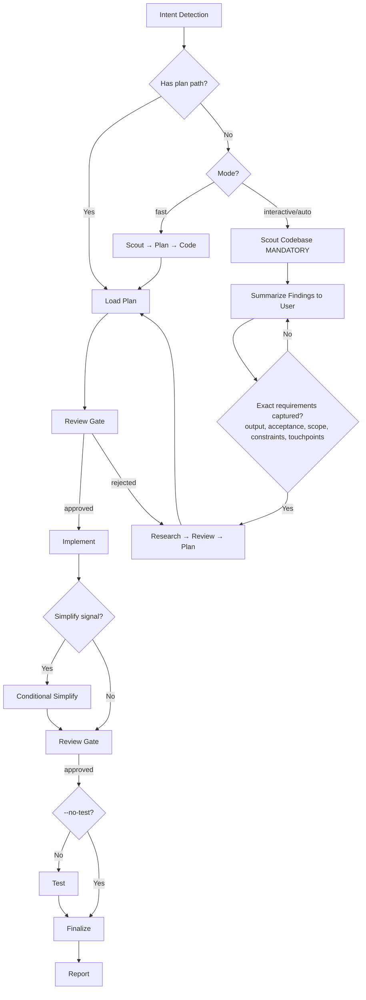

# Cook — Smart Feature Implementation

End-to-end implementation with automatic workflow detection. **Principles:** YAGNI, KISS, DRY | token efficiency | concise reports.

## Context Persistence (always)

Every non-trivial step writes a durable markdown artifact under the plan directory — never keep plan/decision/findings only in chat. This lets the user review at any gate and lets a future session (or compaction) recover full context with no loss.

- **Plan** → `plans/{YYMMDD-HHMM}-{slug}/plan.md` + `phase-XX-*.md`
- **Research / scout** → `plans/{plan-dir}/research/` and `reports/`
- **Anything unclear or decided** → record it in the plan/phase file before acting on it

If no plan path is given and the task is non-trivial, create the plan dir first (see HARD-GATE) so the artifact exists before implementation.

## Usage

```
/aka:cook <natural language task OR plan path>
/aka:cook Add user authentication --fast
/aka:cook plans/260524-1430-auth/plan.md --auto
/aka:cook Refactor auth middleware --tdd
```

**IMPORTANT:** No flag → `interactive` mode (default).

**Workflow-mode flags:**

- `--interactive` — Full workflow with user input (**default**)
- `--fast` — Skip research; scout → plan → code
- `--parallel` — Multi-agent execution for 3+ independent features
- `--no-test` — Skip testing step
- `--auto` — Auto-approve low-risk steps; high-risk changes stop for human approval before finalize/commit/ship

**Composable flag** (combine with any mode):

- `--tdd` — Tests-first per phase: write tests for current behavior before refactoring, verify they still pass after

<HARD-GATE>
Do NOT write implementation code until a plan exists and has been reviewed.
This applies regardless of task simplicity. "Simple" tasks are where unexamined assumptions waste the most time.
Exception: `--fast` mode skips research but still requires a plan step.
User override: If user explicitly says "just code it" or "skip planning", respect their instruction.
</HARD-GATE>

<HARD-GATE-SCOUT-FIRST>
Before planning OR asking clarifying questions, scan the codebase (activate `aka:scout`). Mandatory scout outputs:
1. Project type, language(s), framework(s)
2. Existing modules/files relevant to the task
3. Current patterns/conventions for similar features (so the implementation matches them)
4. Existing docs in `./docs/` and any in-flight plans in `./plans/` covering this area
5. Public APIs, schemas, contracts that the task could affect

State a 3-6 bullet codebase-context summary to the user before asking questions. Skip ONLY when input is a `plan.md`/`phase-*.md` path (the plan already encodes scout output).
</HARD-GATE-SCOUT-FIRST>

<HARD-GATE-EXACT-REQUIREMENTS>
Before producing a plan, you MUST answer ALL of these in one concrete sentence each (use `AskUserQuestion` to pin them down — do NOT proceed on vague intent):

1. **Expected output** — the concrete artifact(s) the user will see (file paths, feature behavior, UI screen, API endpoint + payload, CLI command + flags).
2. **Acceptance criteria** — specific behaviors / inputs → outputs / edge cases that MUST work to call it "done".
3. **Scope boundary** — what is explicitly OUT of scope this round.
4. **Non-negotiable constraints** — stack, file locations, naming, backward compatibility, deadlines, performance.
5. **Touchpoints** — which existing files/modules (from scout) will be modified or extended; which contracts must stay stable.

Ground every `AskUserQuestion` option in scout findings (e.g., "Add to `src/api/users.ts` (matches existing pattern) or new `src/api/profile.ts`?"). Skip ONLY when input is a `plan.md`/`phase-*.md` path.
</HARD-GATE-EXACT-REQUIREMENTS>

<HARD-GATE-NO-SIDE-EFFECTS>
Implementation is NOT done until verified side-effect-free. Code-review and test gates MUST prove:

1. New behavior matches every acceptance criterion above.
2. All tests pass — including tests in modules that share files/contracts with the change.
3. No existing business-logic / workflow regression: explicitly walk each touchpoint and any caller of changed functions.
4. No new lint/type/build errors anywhere in the repo.
5. Public contracts unchanged unless intentional and called out (function signatures, exported types, API responses, DB schemas, env vars, config keys).

User override: If user invoked `--no-test`, item 2 is downgraded to a warning. Surface the unverified-tests risk in the finalize `AskUserQuestion` so the user accepts the trade-off. Items 1, 3, 4, 5 remain enforceable via the mandatory `code-reviewer` subagent.

If review/testing reveals a side effect, regression, or broken workflow, STOP. Use `AskUserQuestion` to present:
- What broke (file, test, workflow, user-facing behavior)
- Why this implementation caused it (1-line cause)
- 2-4 concrete options, e.g.: "Revert and re-plan with stricter scope" / "Keep and update dependents to match new contract" / "Add a compatibility shim at the boundary" / "Accept the regression — old behavior was buggy"

Let the user decide. Do not silently patch around regressions.
</HARD-GATE-NO-SIDE-EFFECTS>

## Anti-Rationalization

| Thought | Reality |
|---------|---------|
| "This is too simple to plan" | Simple tasks have hidden complexity. Plan takes 30 seconds. |
| "I already know how to do this" | Knowing ≠ planning. Write it down. |
| "Let me just start coding" | Undisciplined action wastes tokens. Plan first. |
| "The user wants speed" | Fastest path = plan → implement → done. Not: implement → debug → rewrite. |
| "I'll plan as I go" | That's not planning, that's hoping. |
| "Just this once" | Every skip is "just this once." No exceptions. |

## Smart Intent Detection

| Input pattern | Mode | Behavior |
|---------------|------|----------|
| Path to `plan.md` or `phase-*.md` | code | Execute existing plan |
| Contains "fast", "quick" | fast | Skip research, scout→plan→code |
| Contains "trust me", "auto" | auto | Auto-approve low-risk steps; stop on high-risk |
| Lists 3+ features OR "parallel" | parallel | Multi-agent execution |
| Contains "no test", "skip test" | no-test | Skip testing step |
| Default | interactive | Full workflow with user input |

See `references/intent-detection.md` for the full detection algorithm and conflict resolution.

## Process Flow (Authoritative)



**This diagram is the authoritative workflow.** Prose below details each node. If prose conflicts with the diagram, follow the diagram.

## Workflow Overview

```
[Intent Detection] → [Research?] → [Review] → [Plan] → [Review] → [Implement] → [Conditional Simplify?] → [Review] → [Test?] → [Review] → [Finalize]
```

**Default (non-auto):** Stop at `[Review]` gates for human approval before each major step.
**Auto mode (`--auto`):** Skip human review gates only for low-risk work; high-risk changes stop before finalize/commit/ship.
**Claude Tasks:** Use `TaskCreate`/`TaskUpdate`/`TaskGet`/`TaskList` during implementation. **Fallback:** CLI-only — if they error, use `TodoWrite`.

| Mode | Research | Testing | Review gates | Phase progression |
|------|----------|---------|--------------|-------------------|
| interactive | ✓ | ✓ | **User approval at each step** | One at a time |
| auto | ✓ | ✓ | Auto only if review passes & high-risk stop is false | All low-risk phases continuously |
| fast | ✗ | ✓ | **User approval at each step** | One at a time |
| parallel | Optional | ✓ | **User approval at each step** | Parallel groups |
| no-test | ✓ | ✗ | **User approval at each step** | One at a time |
| code | ✗ | ✓ | **User approval at each step** | Per plan |

See `references/workflow-steps.md` for detailed step definitions across all modes.

## Steps (summary)

1. **Scout** — `aka:scout` (skip in code mode if plan has context)
2. **Research** — `researcher` subagents (skip fast/code)
3. **Plan** — `/aka:plan` or read existing plan; get approval unless auto
4. **Implement** — Follow plan phases; one at a time unless auto. Compile/typecheck after each file. `--tdd` splits each phase into write-tests → implement → verify.
5. **Conditional Simplify** — live-diff gated (see below)
6. **Test** — Spawn `tester` subagent; activate `aka:test`. **100% pass required**
7. **Review** — Spawn `code-reviewer` (see `references/review-cycle.md`)
8. **Finalize** (mandatory — see below)

## Blocking Gates (Non-Auto Mode)

Human review required (skipped with `--auto` for low-risk):
- **Post-Research** — review findings before planning
- **Post-Plan** — approve plan before implementation
- **Post-Implementation** — approve code before testing
- **Post-Testing** — 100% pass + approve before finalize

**Always enforced (all modes):**
- **Testing:** 100% pass required (unless no-test mode)
- **Code Review (MANDATORY):** Spawn `code-reviewer` subagent with explicit checks: (a) every acceptance criterion met, (b) no regression to business logic in touchpoints/blast-radius, (c) no breaking changes to public contracts unless called out, (d) follows existing patterns from scout, (e) no new lint/type/build errors anywhere. Pass scout summary + acceptance criteria as context. If reviewer flags side effects → trigger HARD-GATE-NO-SIDE-EFFECTS. Score is advisory; it never approves by itself.
- **Finalize (MANDATORY — never skip):**
  1. Spawn `project-manager` subagent → full plan sync-back across ALL `phase-XX-*.md` (not only current phase): mark every completed `[ ] → [x]`, update `plan.md` status/progress from actual checkbox state, return unresolved mappings.
  2. Spawn `docs-manager` subagent → update `./docs` if changes warrant.
  3. `TaskUpdate` → mark Claude Tasks complete after sync-back (skip if Task tools unavailable).
  4. Ask user about commit via `aka:commit` / `git-manager` subagent.

## Conditional Simplify (live-diff gated)

Recompute signals from the live worktree:

```bash
totals=$(git diff --numstat HEAD --ignore-all-space)
loc=$(echo "$totals" | awk '{s+=$1+$2} END {print s+0}')
files=$(echo "$totals" | awk 'NF{c++} END {print c+0}')
maxFile=$(echo "$totals" | awk 'BEGIN{m=0} {if ($1>m) m=$1} END {print m+0}')
```

If any default threshold is breached — **400 LOC delta**, **8 files**, or **200 single-file LOC** — spawn the simplifier scoped to modified files:

```
Task(subagent_type="code-simplifier", prompt="Simplify these files while preserving behavior exactly: [file-list]", description="Simplify recent edits")
```

After it returns, log only — never re-run or block. Verify with `git diff --shortstat HEAD -- [file-list]` before/after; do not rely on the agent's prose summary.

## Required Subagents (MANDATORY)

| Phase | Subagent | Requirement |
|-------|----------|-------------|
| Research | `researcher` | Optional in fast/code |
| Scout | `scout` / `aka:scout` skill | Optional in code |
| Plan | `planner` | Optional in code |
| UI work | `ui-ux-designer` | If frontend work |
| Testing | `tester`, `debugger` | **MUST** spawn |
| Review | `code-reviewer` | **MUST** spawn |
| Finalize | `project-manager`, `docs-manager`, `git-manager` | **MUST** invoke |

**CRITICAL ENFORCEMENT:**
- Steps 6, 7, 8 **MUST** use the Task tool to spawn subagents — do not inline
- DO NOT implement testing, review, or finalization yourself — DELEGATE
- If workflow ends with 0 Task tool calls, it is INCOMPLETE
- UI work → spawn `ui-ux-designer`
- Compile/typecheck after code changes

## Step Output Format

```
✓ Step [N]: [brief status] — [key metrics]
```

Example:
```
✓ Step 1: Scout — 12 files mapped
✓ Step 3: Plan approved — plans/.../plan.md
✓ Step 4: Implemented — 8 files changed
✓ Step 6: Tests — 42/42 passed
✓ Step 7: Review — 9.2/10, 0 critical
✓ Step 8: Finalized — docs updated, committed
```

## References

- `references/intent-detection.md` — detection rules and routing
- `references/workflow-steps.md` — detailed step definitions for all modes
- `references/review-cycle.md` — interactive and auto review processes
- `references/subagent-patterns.md` — subagent invocation patterns

## Workflow Position

**Typically follows:** `/aka:plan` (execute a plan)
**Typically precedes:** `/aka:ship` (merge and open PR), `/aka:code-review`
**Related:** `/aka:fix` (alternative for bug fixes)
